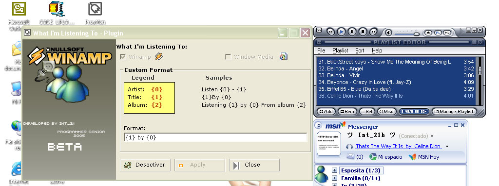

<div align="center">

## Msn Messenger 7 "What I'm Listening To"


</div>

### Description

This my first version, 2&#170; version coming soon!!

Let you put what you're current playing in winamp,

like windows media player does, just using Winamp API SDK from www.winamp.com

;)have fun!
 
### More Info
 


<span>             |<span>
---                |---
**Submitted On**   |2005-04-25 10:25:36
**By**             |[Int\_21](https://github.com/Planet-Source-Code/PSCIndex/blob/master/ByAuthor/int-21.md)
**Level**          |Intermediate
**User Rating**    |5.0 (15 globes from 3 users)
**Compatibility**  |VB 5\.0, VB 6\.0
**Category**       |[Sound/MP3](https://github.com/Planet-Source-Code/PSCIndex/blob/master/ByCategory/sound-mp3__1-45.md)
**World**          |[Visual Basic](https://github.com/Planet-Source-Code/PSCIndex/blob/master/ByWorld/visual-basic.md)
**Archive File**   |[Msn\_Messen1880934252005\.zip](https://github.com/Planet-Source-Code/int-21-msn-messenger-7-what-i-m-listening-to__1-60200/archive/master.zip)

### API Declarations

```
Declare Function SendMessage Lib "user32" Alias "SendMessageA" (ByVal hwnd As Long, ByVal wMsg As Long, ByVal wParam As Long, ByVal lParam As Long) As Long
Declare Function FindWindow Lib "user32" Alias "FindWindowA" (ByVal lpClassName As String, ByVal lpWindowName As String) As Long
Declare Function FindWindowEx Lib "user32" Alias "FindWindowExA" (ByVal hWnd1 As Long, ByVal hWnd2 As Long, ByVal lpsz1 As String, ByVal lpsz2 As String) As Long
Declare Function GetWindowText Lib "user32" Alias "GetWindowTextA" (ByVal hwnd As Long, ByVal lpString As String, ByVal cch As Long) As Long
```


